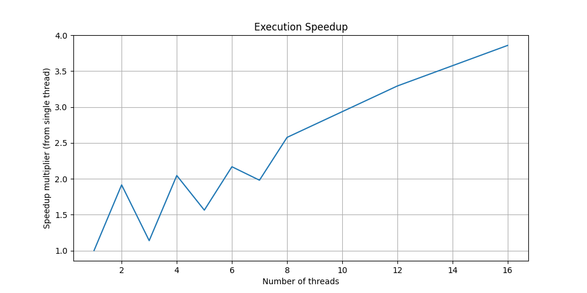
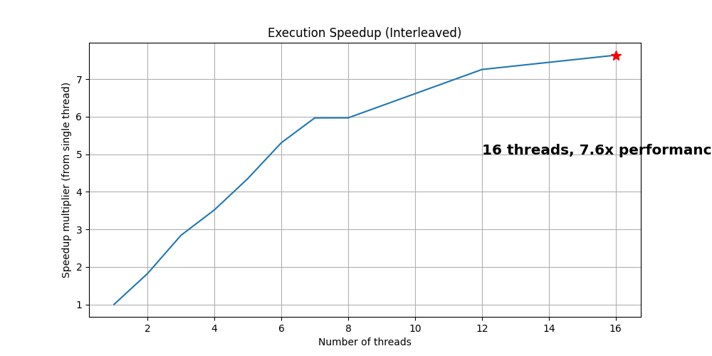
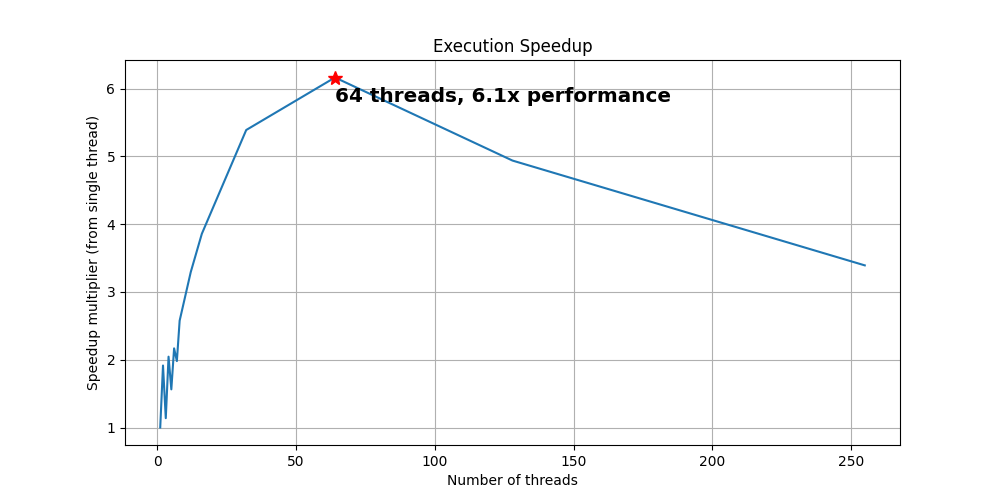
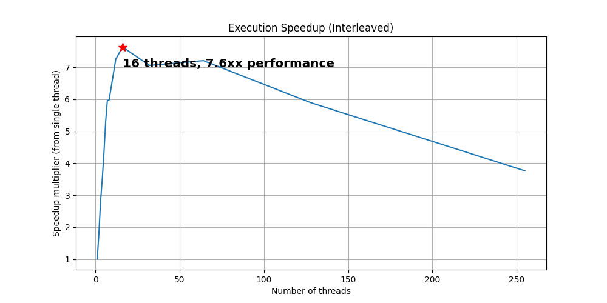

## Setup 
- For image of size 1001 x  1001, with atmost 255 iterations to check divergence of 10 units.
- AMD Ryzen 7 7840HS, 8-core, 16-threads 

## Performace Highlights:
Without interleaving:
- Time to compute with 1 threads: 149.218 ms (1.000x) 
- Time to compute with 2 threads: 77.942 ms (1.914x)
- Time to compute with 3 threads: 131.177 ms (1.138x)
- Time to compute with 4 threads: 72.974 ms (2.045x)
- Time to compute with 5 threads: 95.498 ms (1.563x) 
- Time to compute with 6 threads: 68.850 ms (2.167x)
- Time to compute with 7 threads: 75.378 ms (1.980x)
- Time to compute with 8 threads: 57.926 ms (2.576x) 
- Time to compute with 12 threads: 45.324 ms (3.292x) 
- Time to compute with 16 threads: 38.684 ms (3.857x) 
- Time to compute with 32 threads: 27.692 ms (5.388x) 
- Time to compute with 64 threads: 24.414 ms (6.112x) 
- Time to compute with 128 threads: 30.221 ms (4.938x)
- Time to compute with 255 threads: 43.996 ms (3.392 x)

With interleaving:
- Time to compute with 1 threads: 140.068ms (1.000)
- Time to compute with 2 threads: 76.91ms (1.821)
- Time to compute with 3 threads: 49.342ms (2.839)
- Time to compute with 4 threads: 39.836ms (3.516)
- Time to compute with 5 threads: 32.187ms (4.352)
- Time to compute with 6 threads: 26.412ms (5.303)
- Time to compute with 7 threads: 23.479ms (5.966)
- Time to compute with 8 threads: 23.473ms (5.967)
- Time to compute with 12 threads: 19.308ms (7.254)
- Time to compute with 16 threads: 18.344ms (7.636)
- Time to compute with 32 threads: 19.845ms (7.058)
- Time to compute with 64 threads: 19.434ms (7.207)
- Time to compute with 128 threads: 23.785ms (5.889)
- Time to compute with 255 threads: 37.232ms (3.762)

### Execution Speedup






## Debug Log

```
1 threads
[Thread 0]: 148.937 ms 
Time to compute with 1 threads: 149.218 ms (1.000 x) 
2 threads
[Thread 0]: 75.319 ms 
[Thread 1]: 77.223 ms 
Time to compute with 2 threads: 77.942 ms (1.914 x) 
3 threads
[Thread 0]: 11.733 ms 
[Thread 2]: 12.903 ms 
[Thread 1]: 130.325 ms 
Time to compute with 3 threads: 131.177 ms (1.138 x) 
4 threads
[Thread 0]: 6.029 ms 
[Thread 3]: 6.271 ms 
[Thread 1]: 69.441 ms 
[Thread 2]: 72.174 ms 
Time to compute with 4 threads: 72.974 ms (2.045 x) 
5 threads
[Thread 0]: 5.330 ms 
[Thread 4]: 4.933 ms 
[Thread 1]: 23.686 ms 
[Thread 3]: 24.590 ms 
[Thread 2]: 94.550 ms 
Time to compute with 5 threads: 95.498 ms (1.563 x) 
6 threads
[Thread 0]: 3.999 ms 
[Thread 5]: 3.653 ms 
[Thread 1]: 8.344 ms 
[Thread 4]: 8.522 ms 
[Thread 2]: 64.859 ms 
[Thread 3]: 68.050 ms 
Time to compute with 6 threads: 68.850 ms (2.167 x) 
7 threads
[Thread 0]: 3.839 ms 
[Thread 1]: 4.013 ms 
[Thread 6]: 4.148 ms 
[Thread 5]: 4.524 ms 
[Thread 2]: 33.438 ms 
[Thread 4]: 34.083 ms 
[Thread 3]: 74.284 ms 
Time to compute with 7 threads: 75.378 ms (1.980 x) 
8 threads
[Thread 0]: 3.203 ms 
[Thread 7]: 2.754 ms 
[Thread 1]: 4.062 ms 
[Thread 6]: 3.798 ms 
[Thread 2]: 15.895 ms 
[Thread 5]: 15.754 ms 
[Thread 3]: 56.320 ms 
[Thread 4]: 56.973 ms 
Time to compute with 8 threads: 57.926 ms (2.576 x) 
12 threads
[Thread 1]: 2.746 ms 
[Thread 0]: 3.257 ms 
[Thread 2]: 3.244 ms 
[Thread 10]: 2.779 ms 
[Thread 9]: 2.984 ms 
[Thread 11]: 3.054 ms 
[Thread 3]: 6.907 ms 
[Thread 8]: 6.683 ms 
[Thread 4]: 24.550 ms 
[Thread 7]: 26.142 ms 
[Thread 5]: 42.274 ms 
[Thread 6]: 44.166 ms 
Time to compute with 12 threads: 45.324 ms (3.292 x) 
16 threads
[Thread 3]: 1.825 ms 
[Thread 0]: 2.693 ms 
[Thread 1]: 2.684 ms 
[Thread 2]: 2.688 ms 
[Thread 12]: 2.588 ms 
[Thread 15]: 2.303 ms 
[Thread 14]: 2.469 ms 
[Thread 13]: 2.738 ms 
[Thread 4]: 5.273 ms 
[Thread 11]: 6.720 ms 
[Thread 10]: 13.935 ms 
[Thread 5]: 14.825 ms 
[Thread 6]: 23.717 ms 
[Thread 9]: 25.811 ms 
[Thread 7]: 34.679 ms 
[Thread 8]: 36.532 ms 
Time to compute with 16 threads: 38.684 ms (3.857 x) 
32 threads
[Thread 0]: 1.212 ms 
[Thread 1]: 1.067 ms 
[Thread 2]: 1.622 ms 
[Thread 3]: 1.696 ms 
[Thread 4]: 1.490 ms 
[Thread 5]: 1.413 ms 
[Thread 6]: 1.400 ms 
[Thread 7]: 1.361 ms 
[Thread 8]: 1.444 ms 
[Thread 9]: 2.608 ms 
[Thread 27]: 1.279 ms 
[Thread 29]: 1.188 ms 
[Thread 30]: 1.156 ms 
[Thread 31]: 1.158 ms 
[Thread 10]: 4.428 ms 
[Thread 28]: 2.522 ms 
[Thread 23]: 1.979 ms 
[Thread 22]: 3.831 ms 
[Thread 24]: 1.691 ms 
[Thread 21]: 5.771 ms 
[Thread 25]: 1.489 ms 
[Thread 26]: 1.373 ms 
[Thread 11]: 10.458 ms 
[Thread 12]: 13.364 ms 
[Thread 20]: 12.989 ms 
[Thread 13]: 14.095 ms 
[Thread 18]: 16.702 ms 
[Thread 19]: 16.646 ms 
[Thread 14]: 17.906 ms 
[Thread 15]: 20.977 ms 
[Thread 17]: 22.706 ms 
[Thread 16]: 24.087 ms 
Time to compute with 32 threads: 27.692 ms (5.388 x) 
64 threads
[Thread 0]: 0.729 ms 
[Thread 1]: 0.723 ms 
[Thread 3]: 0.367 ms 
[Thread 4]: 0.320 ms 
[Thread 2]: 0.769 ms 
[Thread 6]: 0.349 ms 
[Thread 7]: 0.375 ms 
[Thread 5]: 0.791 ms 
[Thread 8]: 0.475 ms 
[Thread 9]: 0.376 ms 
[Thread 10]: 0.395 ms 
[Thread 11]: 0.451 ms 
[Thread 12]: 0.493 ms 
[Thread 13]: 0.389 ms 
[Thread 14]: 0.397 ms 
[Thread 15]: 0.425 ms 
[Thread 16]: 0.458 ms 
[Thread 17]: 0.462 ms 
[Thread 18]: 0.569 ms 
[Thread 19]: 1.004 ms 
[Thread 20]: 1.434 ms 
[Thread 21]: 1.432 ms 
[Thread 22]: 2.367 ms 
[Thread 23]: 4.660 ms 
[Thread 24]: 7.419 ms 
[Thread 25]: 7.524 ms 
[Thread 52]: 0.742 ms 
[Thread 27]: 9.492 ms 
[Thread 28]: 9.475 ms 
[Thread 46]: 3.031 ms 
[Thread 53]: 0.775 ms 
[Thread 26]: 10.617 ms 
[Thread 48]: 0.925 ms 
[Thread 29]: 10.617 ms 
[Thread 63]: 0.579 ms 
[Thread 30]: 13.720 ms 
[Thread 61]: 1.396 ms 
[Thread 56]: 0.690 ms 
[Thread 44]: 4.740 ms 
[Thread 51]: 0.768 ms 
[Thread 49]: 0.854 ms 
[Thread 50]: 0.833 ms 
[Thread 47]: 1.531 ms 
[Thread 45]: 3.625 ms 
[Thread 54]: 0.709 ms 
[Thread 55]: 0.699 ms 
[Thread 59]: 0.674 ms 
[Thread 60]: 0.655 ms 
[Thread 36]: 13.846 ms 
[Thread 57]: 0.696 ms 
[Thread 43]: 8.996 ms 
[Thread 39]: 9.763 ms 
[Thread 62]: 1.716 ms 
[Thread 34]: 13.955 ms 
[Thread 33]: 14.998 ms 
[Thread 35]: 14.758 ms 
[Thread 58]: 0.689 ms 
[Thread 42]: 9.603 ms 
[Thread 31]: 16.050 ms 
[Thread 40]: 8.480 ms 
[Thread 37]: 16.034 ms 
[Thread 32]: 17.454 ms 
[Thread 41]: 9.832 ms 
[Thread 38]: 16.064 ms 
Time to compute with 64 threads: 24.414 ms (6.112 x) 
128 threads
[Thread 0]: 0.337 ms 
[Thread 1]: 0.362 ms 
[Thread 3]: 0.211 ms 
[Thread 2]: 0.370 ms 
[Thread 4]: 0.262 ms 
[Thread 6]: 0.198 ms 
[Thread 5]: 0.346 ms 
[Thread 7]: 0.223 ms 
[Thread 8]: 0.344 ms 
[Thread 9]: 0.317 ms 
[Thread 10]: 0.317 ms 
[Thread 11]: 0.261 ms 
[Thread 12]: 0.169 ms 
[Thread 13]: 0.166 ms 
[Thread 14]: 0.171 ms 
[Thread 15]: 0.175 ms 
[Thread 16]: 0.167 ms 
[Thread 17]: 0.168 ms 
[Thread 18]: 0.170 ms 
[Thread 19]: 0.171 ms 
[Thread 20]: 0.172 ms 
[Thread 21]: 0.172 ms 
[Thread 22]: 0.174 ms 
[Thread 23]: 0.187 ms 
[Thread 24]: 0.170 ms 
[Thread 25]: 0.174 ms 
[Thread 26]: 0.176 ms 
[Thread 27]: 0.178 ms 
[Thread 28]: 0.179 ms 
[Thread 29]: 0.182 ms 
[Thread 30]: 0.186 ms 
[Thread 31]: 0.218 ms 
[Thread 32]: 0.207 ms 
[Thread 33]: 0.199 ms 
[Thread 34]: 0.215 ms 
[Thread 35]: 0.212 ms 
[Thread 36]: 0.221 ms 
[Thread 37]: 0.216 ms 
[Thread 38]: 0.223 ms 
[Thread 39]: 0.309 ms 
[Thread 40]: 0.378 ms 
[Thread 42]: 0.583 ms 
[Thread 41]: 0.726 ms 
[Thread 43]: 0.646 ms 
[Thread 44]: 0.702 ms 
[Thread 45]: 0.675 ms 
[Thread 46]: 0.656 ms 
[Thread 47]: 0.695 ms 
[Thread 48]: 0.924 ms 
[Thread 49]: 1.802 ms 
[Thread 51]: 2.415 ms 
[Thread 50]: 2.675 ms 
[Thread 52]: 2.496 ms 
[Thread 53]: 2.598 ms 
[Thread 55]: 2.810 ms 
[Thread 54]: 3.071 ms 
[Thread 56]: 3.858 ms 
[Thread 62]: 5.201 ms 
[Thread 61]: 5.602 ms 
[Thread 63]: 5.831 ms 
[Thread 57]: 3.972 ms 
[Thread 58]: 4.073 ms 
[Thread 59]: 4.262 ms 
[Thread 60]: 4.162 ms 
[Thread 66]: 5.645 ms 
[Thread 65]: 6.278 ms 
[Thread 67]: 6.653 ms 
[Thread 75]: 5.833 ms 
[Thread 70]: 6.787 ms 
[Thread 77]: 5.855 ms 
[Thread 78]: 6.202 ms 
[Thread 74]: 6.906 ms 
[Thread 76]: 7.145 ms 
[Thread 68]: 5.391 ms 
[Thread 79]: 5.896 ms 
[Thread 82]: 3.618 ms 
[Thread 87]: 2.872 ms 
[Thread 81]: 4.697 ms 
[Thread 64]: 12.762 ms 
[Thread 80]: 5.065 ms 
[Thread 85]: 4.320 ms 
[Thread 88]: 3.880 ms 
[Thread 84]: 4.638 ms 
[Thread 89]: 3.835 ms 
[Thread 83]: 4.821 ms 
[Thread 86]: 4.356 ms 
[Thread 72]: 12.249 ms 
[Thread 96]: 0.863 ms 
[Thread 69]: 10.809 ms 
[Thread 94]: 1.682 ms 
[Thread 93]: 2.055 ms 
[Thread 98]: 0.811 ms 
[Thread 92]: 2.525 ms 
[Thread 97]: 1.291 ms 
[Thread 99]: 0.928 ms 
[Thread 100]: 0.862 ms 
[Thread 103]: 0.319 ms 
[Thread 102]: 0.553 ms 
[Thread 73]: 13.111 ms 
[Thread 101]: 0.748 ms 
[Thread 95]: 1.096 ms 
[Thread 91]: 3.232 ms 
[Thread 104]: 0.325 ms 
[Thread 105]: 0.248 ms 
[Thread 106]: 0.275 ms 
[Thread 107]: 0.244 ms 
[Thread 90]: 6.216 ms 
[Thread 108]: 0.251 ms 
[Thread 109]: 0.233 ms 
[Thread 110]: 0.225 ms 
[Thread 111]: 0.240 ms 
[Thread 112]: 0.211 ms 
[Thread 113]: 0.209 ms 
[Thread 71]: 10.794 ms 
[Thread 114]: 0.205 ms 
[Thread 115]: 0.224 ms 
[Thread 116]: 0.310 ms 
[Thread 117]: 0.202 ms 
[Thread 118]: 0.198 ms 
[Thread 119]: 0.197 ms 
[Thread 120]: 0.194 ms 
[Thread 121]: 0.192 ms 
[Thread 122]: 0.200 ms 
[Thread 123]: 0.188 ms 
[Thread 124]: 0.187 ms 
[Thread 125]: 0.188 ms 
[Thread 126]: 0.188 ms 
[Thread 127]: 0.190 ms 
Time to compute with 128 threads: 30.221 ms (4.938 x) 
255 threads
[Thread 0]: 0.131 ms 
[Thread 1]: 0.144 ms 
[Thread 2]: 0.063 ms 
[Thread 3]: 0.062 ms 
[Thread 4]: 0.141 ms 
[Thread 5]: 0.151 ms 
[Thread 6]: 0.155 ms 
[Thread 7]: 0.140 ms 
[Thread 8]: 0.063 ms 
[Thread 9]: 0.139 ms 
[Thread 10]: 0.062 ms 
[Thread 11]: 0.065 ms 
[Thread 12]: 0.061 ms 
[Thread 13]: 0.061 ms 
[Thread 14]: 0.149 ms 
[Thread 15]: 0.061 ms 
[Thread 16]: 0.138 ms 
[Thread 17]: 0.061 ms 
[Thread 18]: 0.061 ms 
[Thread 19]: 0.061 ms 
[Thread 20]: 0.061 ms 
[Thread 21]: 0.061 ms 
[Thread 22]: 0.061 ms 
[Thread 23]: 0.072 ms 
[Thread 24]: 0.065 ms 
[Thread 25]: 0.064 ms 
[Thread 26]: 0.063 ms 
[Thread 27]: 0.064 ms 
[Thread 28]: 0.064 ms 
[Thread 29]: 0.064 ms 
[Thread 30]: 0.065 ms 
[Thread 31]: 0.065 ms 
[Thread 32]: 0.073 ms 
[Thread 33]: 0.067 ms 
[Thread 34]: 0.067 ms 
[Thread 35]: 0.066 ms 
[Thread 36]: 0.066 ms 
[Thread 37]: 0.067 ms 
[Thread 38]: 0.067 ms 
[Thread 39]: 0.067 ms 
[Thread 40]: 0.067 ms 
[Thread 41]: 0.153 ms 
[Thread 42]: 0.068 ms 
[Thread 43]: 0.068 ms 
[Thread 44]: 0.068 ms 
[Thread 45]: 0.155 ms 
[Thread 46]: 0.068 ms 
[Thread 47]: 0.068 ms 
[Thread 48]: 0.068 ms 
[Thread 49]: 0.069 ms 
[Thread 50]: 0.127 ms 
[Thread 51]: 0.070 ms 
[Thread 52]: 0.161 ms 
[Thread 53]: 0.071 ms 
[Thread 54]: 0.071 ms 
[Thread 55]: 0.160 ms 
[Thread 56]: 0.161 ms 
[Thread 57]: 0.084 ms 
[Thread 58]: 0.072 ms 
[Thread 59]: 0.073 ms 
[Thread 60]: 0.166 ms 
[Thread 61]: 0.073 ms 
[Thread 62]: 0.155 ms 
[Thread 63]: 0.077 ms 
[Thread 64]: 0.074 ms 
[Thread 65]: 0.074 ms 
[Thread 66]: 0.074 ms 
[Thread 67]: 0.075 ms 
[Thread 68]: 0.076 ms 
[Thread 69]: 0.076 ms 
[Thread 70]: 0.077 ms 
[Thread 71]: 0.077 ms 
[Thread 72]: 0.078 ms 
[Thread 73]: 0.080 ms 
[Thread 74]: 0.184 ms 
[Thread 75]: 0.082 ms 
[Thread 76]: 0.081 ms 
[Thread 77]: 0.186 ms 
[Thread 78]: 0.083 ms 
[Thread 79]: 0.087 ms 
[Thread 80]: 0.092 ms 
[Thread 81]: 0.091 ms 
[Thread 82]: 0.141 ms 
[Thread 84]: 0.096 ms 
[Thread 83]: 0.207 ms 
[Thread 86]: 0.090 ms 
[Thread 85]: 0.208 ms 
[Thread 87]: 0.206 ms 
[Thread 89]: 0.100 ms 
[Thread 88]: 0.214 ms 
[Thread 90]: 0.201 ms 
[Thread 91]: 0.097 ms 
[Thread 92]: 0.108 ms 
[Thread 93]: 0.124 ms 
[Thread 94]: 0.158 ms 
[Thread 95]: 0.149 ms 
[Thread 96]: 0.160 ms 
[Thread 97]: 0.196 ms 
[Thread 98]: 0.223 ms 
[Thread 99]: 0.262 ms 
[Thread 100]: 0.279 ms 
[Thread 101]: 0.273 ms 
[Thread 102]: 0.271 ms 
[Thread 103]: 0.315 ms 
[Thread 104]: 0.309 ms 
[Thread 106]: 0.280 ms 
[Thread 105]: 0.586 ms 
[Thread 107]: 0.282 ms 
[Thread 108]: 0.277 ms 
[Thread 109]: 0.304 ms 
[Thread 110]: 0.263 ms 
[Thread 111]: 0.269 ms 
[Thread 112]: 0.310 ms 
[Thread 113]: 0.460 ms 
[Thread 114]: 0.525 ms 
[Thread 115]: 0.594 ms 
[Thread 117]: 0.697 ms 
[Thread 116]: 0.893 ms 
[Thread 118]: 0.877 ms 
[Thread 119]: 1.005 ms 
[Thread 121]: 0.960 ms 
[Thread 123]: 1.025 ms 
[Thread 122]: 1.376 ms 
[Thread 125]: 1.043 ms 
[Thread 120]: 1.745 ms 
[Thread 124]: 1.264 ms 
[Thread 127]: 0.970 ms 
[Thread 126]: 1.282 ms 
[Thread 128]: 1.190 ms 
[Thread 129]: 1.204 ms 
[Thread 130]: 1.214 ms 
[Thread 131]: 1.066 ms 
[Thread 133]: 1.166 ms 
[Thread 134]: 1.034 ms 
[Thread 135]: 1.088 ms 
[Thread 138]: 1.239 ms 
[Thread 136]: 1.717 ms 
[Thread 140]: 1.242 ms 
[Thread 137]: 1.817 ms 
[Thread 139]: 1.680 ms 
[Thread 141]: 1.385 ms 
[Thread 142]: 1.210 ms 
[Thread 132]: 2.852 ms 
[Thread 144]: 1.388 ms 
[Thread 143]: 1.653 ms 
[Thread 145]: 1.685 ms 
[Thread 147]: 1.719 ms 
[Thread 146]: 1.864 ms 
[Thread 149]: 2.164 ms 
[Thread 148]: 2.409 ms 
[Thread 150]: 2.437 ms 
[Thread 152]: 2.324 ms 
[Thread 151]: 2.562 ms 
[Thread 154]: 2.126 ms 
[Thread 153]: 2.565 ms 
[Thread 156]: 2.405 ms 
[Thread 155]: 2.584 ms 
[Thread 157]: 2.360 ms 
[Thread 159]: 1.923 ms 
[Thread 160]: 2.105 ms 
[Thread 158]: 2.461 ms 
[Thread 162]: 2.055 ms 
[Thread 161]: 2.311 ms 
[Thread 163]: 1.913 ms 
[Thread 165]: 2.053 ms 
[Thread 164]: 2.260 ms 
[Thread 168]: 2.048 ms 
[Thread 169]: 2.205 ms 
[Thread 166]: 2.693 ms 
[Thread 167]: 2.575 ms 
[Thread 172]: 2.295 ms 
[Thread 170]: 2.661 ms 
[Thread 171]: 2.542 ms 
[Thread 173]: 2.432 ms 
[Thread 175]: 2.271 ms 
[Thread 177]: 2.020 ms 
[Thread 174]: 2.649 ms 
[Thread 176]: 2.510 ms 
[Thread 178]: 2.566 ms 
[Thread 180]: 2.312 ms 
[Thread 179]: 3.239 ms 
[Thread 181]: 2.517 ms 
[Thread 182]: 2.493 ms 
[Thread 183]: 2.429 ms 
[Thread 184]: 2.455 ms 
[Thread 185]: 2.335 ms 
[Thread 186]: 2.305 ms 
[Thread 187]: 2.156 ms 
[Thread 188]: 2.078 ms 
[Thread 189]: 1.965 ms 
[Thread 190]: 1.966 ms 
[Thread 192]: 1.697 ms 
[Thread 191]: 1.887 ms 
[Thread 193]: 1.829 ms 
[Thread 194]: 1.993 ms 
[Thread 195]: 1.518 ms 
[Thread 196]: 1.397 ms 
[Thread 199]: 1.197 ms 
[Thread 198]: 1.426 ms 
[Thread 197]: 1.761 ms 
[Thread 200]: 1.477 ms 
[Thread 202]: 1.195 ms 
[Thread 201]: 1.764 ms 
[Thread 206]: 1.083 ms 
[Thread 204]: 1.435 ms 
[Thread 205]: 1.292 ms 
[Thread 203]: 1.687 ms 
[Thread 207]: 1.280 ms 
[Thread 208]: 1.178 ms 
[Thread 210]: 1.077 ms 
[Thread 209]: 1.313 ms 
[Thread 212]: 1.072 ms 
[Thread 211]: 1.297 ms 
[Thread 214]: 1.003 ms 
[Thread 215]: 0.954 ms 
[Thread 216]: 0.834 ms 
[Thread 217]: 0.745 ms 
[Thread 218]: 0.657 ms 
[Thread 219]: 0.574 ms 
[Thread 213]: 1.549 ms 
[Thread 220]: 0.457 ms 
[Thread 221]: 0.305 ms 
[Thread 222]: 0.284 ms 
[Thread 223]: 0.297 ms 
[Thread 224]: 0.306 ms 
[Thread 225]: 0.314 ms 
[Thread 226]: 0.357 ms 
[Thread 227]: 0.339 ms 
[Thread 228]: 0.329 ms 
[Thread 229]: 0.329 ms 
[Thread 230]: 0.316 ms 
[Thread 231]: 0.305 ms 
[Thread 232]: 0.312 ms 
[Thread 233]: 0.325 ms 
[Thread 234]: 0.292 ms 
[Thread 235]: 0.247 ms 
[Thread 236]: 0.283 ms 
[Thread 237]: 0.169 ms 
[Thread 238]: 0.167 ms 
[Thread 239]: 0.159 ms 
[Thread 240]: 0.149 ms 
[Thread 241]: 0.116 ms 
[Thread 242]: 0.108 ms 
[Thread 243]: 0.106 ms 
[Thread 244]: 0.105 ms 
[Thread 245]: 0.104 ms 
[Thread 246]: 0.100 ms 
[Thread 247]: 0.099 ms 
[Thread 248]: 0.104 ms 
[Thread 249]: 0.179 ms 
[Thread 250]: 0.098 ms 
[Thread 251]: 0.195 ms 
[Thread 252]: 0.122 ms 
[Thread 253]: 0.097 ms 
[Thread 254]: 0.132 ms 
Time to compute with 255 threads: 43.996 ms (3.392 x) 
```